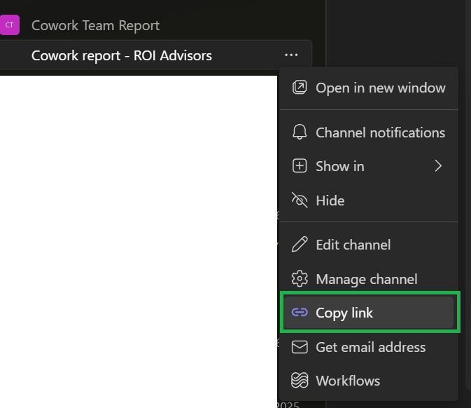
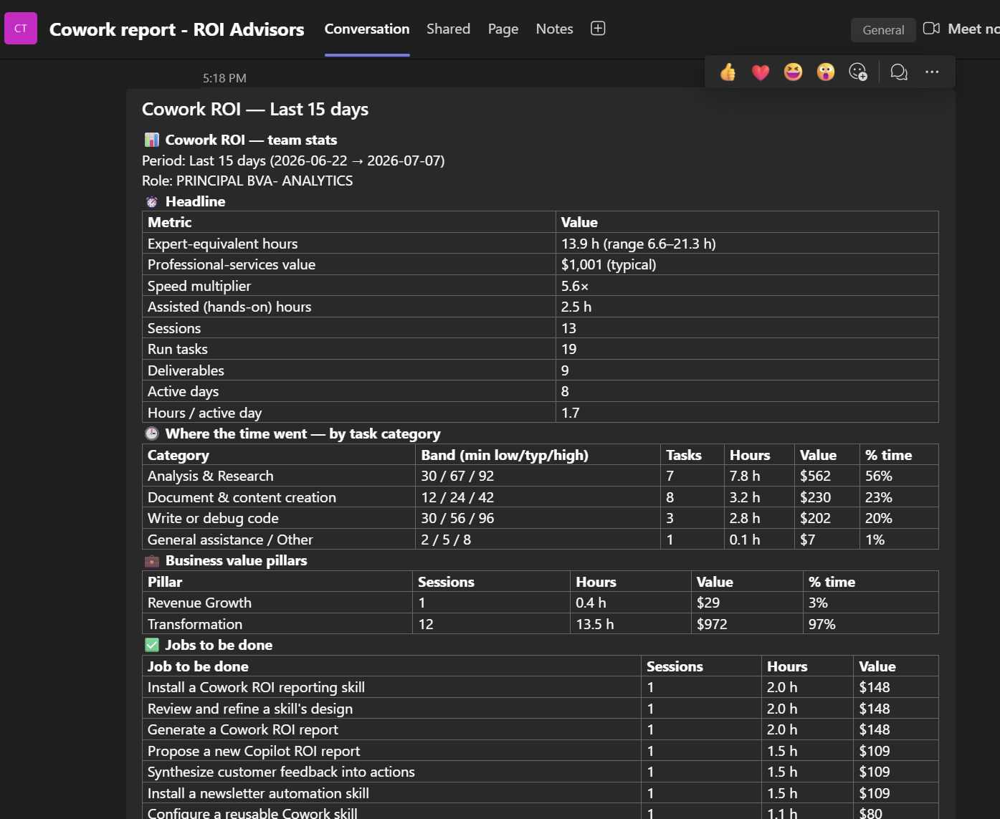

# Cowork ROI — Member skill

A self-contained skill for **Microsoft Copilot Cowork** that posts a **de-identified, table-formatted Cowork ROI summary** to your team's Teams channel — with a **privacy opt-out** so you can exclude any chat or task before it posts.

This is the **aggregated / team-rollup member step** companion to the personal [What Cowork Did for Me](https://github.com/Fepilot/What-Cowork-did-for-me) report skill.

## Contents

- [What it does](#what-it-does)
- [Download](#download)
- [First-time setup — for admins / managers / leads only](#first-time-setup)
- [Use it / run it — for everyone](#use-it)

## What it does

It harvests your own Copilot Cowork sessions from OneDrive, computes research-anchored **time-saved / value / speed** metrics, and renders them as HTML tables (headline KPIs, time-by-category, value pillars, jobs-to-be-done, work-by-business-process, roles, skills, analyzed → produced, deliverables, activity-by-day).

Privacy by design:
- **Person names, file names and prompts are excluded**
- Business processes are grouped into a short canonical set
- Each deliverable is labelled with the business process it supported (no file names)
- Every session is individually selectable in a privacy opt-out picker before posting

## Download

Grab everything in one file: [`cowork-roi-member.zip`](cowork-roi-member.zip) — contains the full `cowork-roi-member/` skill folder ready to unzip into your Cowork skills directory.

## Install

This skill is **self-contained** — it bundles its own analysis pipeline (`classify.py`, `compute.py`, taxonomy data, harvest references). No other skill is required.

1. Copy the whole [`cowork-roi-member/`](cowork-roi-member/) folder into your Cowork skills directory:
   `Documents/Cowork/skills/cowork-roi-member/`
2. Changes appear after OneDrive sync (~35 seconds).

## First-time setup — for the admin / manager / lead only (read this before your first run)

This skill posts each person's report into a **shared Teams channel** that the whole team writes to. If you run the skill without belonging to that channel, it has **nowhere to post** and will not work.

So before anyone runs it, the team needs **one** dedicated Teams channel, created by the group's **manager / admin / lead**. This is a **one-time setup** — once it's in place and automated, nobody needs to do it again.

> **Are you a team member (not the lead)?** Wait for your manager/admin/lead to send you the channel link, then jump to [Use it — for team members](#use-it). Everything below in this section is for the person setting the channel up.

### For the manager / admin / lead — how to configure the channel

1. **Create a Teams channel** named:
   `Cowork Report - {name of your team}`
   (for example, `Cowork Report - ROI Advisors`).
2. **Invite everyone who will be measured** in the run and add them as **owners** of the channel.
3. **Keep the channel data-only.** This channel exists *only* for the Cowork member skill to post individual reports. **Nobody should hold manual conversations in it** — stray messages can break the downstream digestion/aggregation of the data.
4. **Copy the channel link.** Open the channel's **⋯** menu and choose **Copy link**:

   

5. **Share that link with your team.** Every member will paste it when they run the skill (see below), so the reports all land in this one channel.

## Use it — for team members

Ask Cowork: **"post my Cowork ROI stats to the team channel."**

The first time you run it, the skill will **ask which Teams channel to post the report to**. Paste the channel link your manager / admin / lead shared with you (the one they copied in step 4 above). After that, the skill posts your de-identified report straight into the shared channel.

Here's what a posted report looks like in the channel:

See [`cowork-roi-member/README.md`](cowork-roi-member/README.md) and [`cowork-roi-member/SKILL.md`](cowork-roi-member/SKILL.md) for full documentation.
